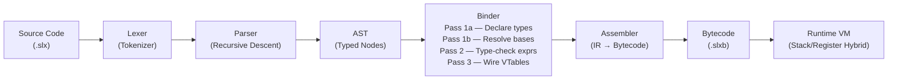

# Solix

> **A statically typed, object-oriented systems language with deterministic ARC memory management.**

[](./docs/PLAN.md)
[](#license--contributing)
[](./language/)
[](./tests/)

---

## Table of Contents

1. [Language Overview & Philosophy](#language-overview--philosophy)
2. [Architecture Pipeline](#architecture-pipeline)
3. [Prerequisites & Toolchain Setup](#prerequisites--toolchain-setup)
4. [CLI Quickstart Tutorial](#cli-quickstart-tutorial)
5. [Key Language Features](#key-language-features)
6. [Project Directory Tour](#project-directory-tour)
7. [License & Contributing](#license--contributing)

---

## Language Overview & Philosophy

Solix is a general-purpose, statically typed, object-oriented systems language designed for correctness, predictability, and performance. Its design philosophy centers on three pillars:

### 1. Strong Static Typing with Generics

Every value in Solix has a type known at compile time. The type system supports full **single inheritance** class hierarchies, **multiple interface implementation**, **generic (template) classes and methods**, and structural type checking through the binder. There are no implicit coercions — all conversions are explicit, reducing an entire class of runtime errors before a program ever runs.

### 2. Deterministic Memory Management via ARC

Solix uses **Automatic Reference Counting (ARC)** — not a tracing garbage collector. Object lifetimes are managed by reference counts that are incremented and decremented at well-defined points in the program. This means:

- **No GC pauses** — memory is reclaimed immediately when the last reference to an object is dropped.
- **Predictable latency** — critical for systems, game, and real-time code.
- **Weak references** — first-class `weak` reference type breaks retain cycles without requiring manual memory management or unsafe pointers.

### 3. Portable Bytecode VM

Solix compiles to a compact **stack/register hybrid bytecode** format (`.slxb`). The runtime is a high-performance VM implemented in **C++20**, with:

- A hand-written **lexer** and **recursive descent parser** producing a typed AST.
- A **multi-pass binder** that resolves names, checks types, wires VTables, and emits IR.
- An **assembler** that lowers IR to dense bytecode.
- A **VM** that executes bytecode with a stack-based dispatch loop.

### Key Design Properties

| Property | Solix Behavior |
|---|---|
| Type system | Static, nominally typed |
| Memory model | Deterministic ARC; weak references for cycles |
| Inheritance | Single class inheritance |
| Polymorphism | Interface implementation + virtual dispatch via VTables |
| Generics | Template classes and methods |
| Exception model | Structured `try`/`catch`/`finally` with typed exception objects |
| Compilation target | `.slxb` bytecode for the Solix VM |
| Runtime language | C++20 |

---

## Architecture Pipeline

The Solix compilation and execution pipeline is a sequential series of well-separated stages:



| Stage | Responsibility |
|---|---|
| **Lexer** | Converts raw source text into a flat token stream. Handles keywords, identifiers, literals, and operators. |
| **Parser** | Consumes the token stream via recursive descent and produces an unresolved AST. |
| **AST** | Typed node tree representing the full syntactic structure of a compilation unit. |
| **Binder — Pass 1a** | Discovers and registers all top-level type declarations (classes, interfaces). |
| **Binder — Pass 1b** | Resolves base class and interface relationships; establishes the inheritance graph. |
| **Binder — Pass 2** | Type-checks all expressions and statements; resolves identifiers to their declarations. |
| **Binder — Pass 3** | Constructs VTables for virtual dispatch; emits annotated IR. |
| **Assembler** | Lowers the bound IR into compact stack/register hybrid bytecode instructions. |
| **Runtime VM** | Loads and executes `.slxb` bytecode; manages the ARC heap, call stack, and exception state. |

---

## Prerequisites & Toolchain Setup

### Supported Compilers

| Compiler | Minimum Version |
|---|---|
| Clang | 14+ |
| GCC | 11+ |
| MSVC | 2022 (17.0+) |

A C++20-conforming standard library is required. All three compilers are tested in CI.

### Dependencies

| Dependency | Version | Notes |
|---|---|---|
| CMake | 3.20+ | Required for the build system |
| C++20 stdlib | — | Provided by your compiler toolchain |
| Ninja | Any | Optional but recommended for faster builds |
| Catch2 | v3 (vendored) | Required only for building the test suite |

### Clone & Build

```bash
# Clone the repository
git clone <repo-url>
cd solix

# Configure (Release build, Ninja generator — optional)
cmake -B build -DCMAKE_BUILD_TYPE=Release -G Ninja

# Or without Ninja:
cmake -B build -DCMAKE_BUILD_TYPE=Release

# Build (parallel)
cmake --build build -j$(nproc)
```

Artifacts produced:

- `./build/bin/solix` — the Solix compiler/runner CLI
- `./build/tests/solix_tests` — the Catch2 test suite binary

### Running the Tests

```bash
./build/tests/solix_tests
```

The test suite covers 49 test suites spanning statement parsing, expression evaluation, declarations, control flow, modules, VM execution, and native shared library loading. All suites must pass on a clean build.

---

## CLI Quickstart Tutorial

### Hello, World!

Create a file named `hello.slx`:

```solix
package hello;

import solix.systems.Console;

class Main {
    public static void main(char[][] args) {
        Console.println("Hello, World!");
    }
}
```

**Compile** the source to bytecode:

```bash
./build/bin/solix compile hello.slx -o hello.slxb
```

**Run** the bytecode:

```bash
./build/bin/solix run hello.slxb
```

Expected output:

```
Hello, World!
```

### Valid Execution Entry Points

Solix supports standard static entry point signatures:
- `static int32 main()` — directly returns an integer exit code to the host environment.
- `static void main(char[][] args)` — receives command-line arguments as an array of character buffers.
- `static int32 main(char[][] args)` — receives command-line arguments and returns an integer exit code.

```solix
package hello;

import solix.systems.Console;

class Main {
    public static int32 main(char[][] args) {
        Console.println("Exiting with code 42.");
        return 42;
    }
}
```

```bash
./build/bin/solix run hello.slxb
echo $?   # prints: 42
```

---

## Key Language Features

### Classes, Single Inheritance & Virtual Methods

Solix supports single-class inheritance with explicit `virtual` and `override` keywords for safe virtual dispatch via VTables.

```solix
package shapes;

class Shape {
    protected float64 x;
    protected float64 y;

    public Shape(float64 x, float64 y) {
        this.x = x;
        this.y = y;
    }

    public virtual float64 area() {
        return 0.0;
    }

    public virtual string describe() {
        return "Shape";
    }
}

class Circle extends Shape {
    private float64 radius;

    public Circle(float64 x, float64 y, float64 radius) {
        super(x, y);
        this.radius = radius;
    }

    public override float64 area() {
        return 3.14159265 * this.radius * this.radius;
    }

    public override string describe() {
        return "Circle";
    }
}
```

### Generic (Template) Classes

Template parameters let you write type-safe, reusable data structures.

```solix
package collections;

class Pair<A, B> {
    public A first;
    public B second;

    public Pair(A first, B second) {
        this.first = first;
        this.second = second;
    }

    public A getFirst() { return this.first; }
    public B getSecond() { return this.second; }
}

// Usage
Pair<string, int32> entry = new Pair<string, int32>("age", 30);
Console.println(entry.getFirst());   // age
```

Generic classes can also manage dynamic storage using array types:

```solix
class Stack<T> {
    private T[] data;
    private int32 top;

    public Stack(int32 capacity) {
        this.data = new T[capacity];
        this.top = 0;
    }

    public void push(T item) {
        this.data[this.top] = item;
        this.top = this.top + 1;
    }

    public T pop() {
        this.top = this.top - 1;
        return this.data[this.top];
    }
}
```

### Exception Handling — `try` / `catch` / `finally`

Solix has first-class structured exception handling. `finally` blocks always execute, even when control leaves via `throw` or `return`.

```solix
package demo;

import solix.systems.Console;

class DivisionError extends Exception {
    public DivisionError(string msg) {
        super(msg);
    }
}

class Calculator {
    public static int32 divide(int32 a, int32 b) {
        if (b == 0) {
            throw new DivisionError("Division by zero is undefined.");
        }
        return a / b;
    }
}

class Main {
    public static void main(char[][] args) {
        try {
            int32 result = Calculator.divide(10, 0);
            Console.println(result);
        } catch (DivisionError e) {
            Console.println("Caught: " + e.getMessage());
        } finally {
            Console.println("Cleanup complete.");
        }
    }
}
```

### Weak References — Breaking Retain Cycles

When two objects reference each other, a `weak` reference on one side prevents a retain cycle and allows the ARC runtime to reclaim memory correctly.

```solix
package graph;

class Node {
    public string name;
    public Node next;        // strong — owns the next node
    public weak Node prev;   // weak   — back-reference, does not retain

    public Node(string name) {
        this.name = name;
    }
}

class Main {
    public static void main(char[][] args) {
        Node a = new Node("A");
        Node b = new Node("B");

        a.next = b;   // a retains b  (ref count of b: 1)
        b.prev = a;   // weak ref — does NOT retain a

        // When 'a' goes out of scope, it is reclaimed.
        // 'b' is also reclaimed because the only remaining
        // reference to it (a.next) is gone.
    }
}
```

### Const Variables

`const` binds a name to an immutable value. Reassignment is a compile-time error.

```solix
package demo;

import solix.systems.Console;

class Config {
    public static const int32 MAX_CONNECTIONS = 100;
    public static const string VERSION = "1.0.0";
}

class Main {
    public static void main(char[][] args) {
        const float64 PI = 3.14159265;
        Console.println("Pi = " + PI);
        Console.println("Max connections: " + Config.MAX_CONNECTIONS);

        // PI = 3.0;  ← compile error: cannot assign to const
    }
}
```

---

## Project Directory Tour

```
solix/
├── language/          # Core compiler and runtime
├── launcher/          # CLI executable
├── tests/             # Catch2 test suite (49 suites)
├── docs/
│   ├── spec/          # Formal language & VM specification
│   ├── wiki/          # Developer reference
│   ├── guide/         # Progressive developer guides
│   └── PLAN.md        # Master development roadmap
└── README.md          # This file
```

| Directory | Contents |
|---|---|
| [`language/`](./language/) | Core compiler and runtime: lexer, recursive descent parser, multi-pass binder, assembler, and stack/register hybrid bytecode VM — all implemented in C++20. |
| [`launcher/`](./launcher/) | The `solix` CLI binary (`compile`, `run`, `inspect` subcommands). |
| [`tests/`](./tests/) | Catch2 test suite with 49 self-contained test suites covering statement parsing, expression evaluation, type binding, assembler output, VM execution correctness, and native shared library plugins. |
| [`docs/spec/`](./docs/spec/) | Formal language specification and VM specification documents detailing grammar, type rules, bytecode encoding, native interop, and ARC semantics. |
| [`docs/wiki/`](./docs/wiki/) | Developer reference: complete keyword glossary, built-in type reference, and standard library API documentation. |
| [`docs/guide/`](./docs/guide/) | Progressive developer guides, from getting started through advanced topics like generics, exception handling, ARC patterns, and native C/C++ plugins. |
| [`docs/PLAN.md`](./docs/PLAN.md) | Master development roadmap: completed milestones, in-progress work, and upcoming feature targets. |

---

## License & Contributing

Solix is open-source software released under the **MIT License**. See [`LICENSE`](./LICENSE) for the full text.

Contributions are warmly welcome — whether that is bug reports, documentation improvements, new standard library modules, or compiler features. To contribute:

1. Fork the repository and create a feature branch.
2. Ensure all 49 test suites pass (`ctest --test-dir build` or `./build/tests/solix_tests`).
3. Add tests for any new language behaviour or compiler stage changes.
4. Open a pull request with a clear description of the change and its motivation.

For larger changes, please open an issue first to discuss the design so effort is not wasted. See [`docs/PLAN.md`](./docs/PLAN.md) for the current roadmap and a list of known areas where help is most needed.

---

*Solix — predictable performance, no surprises.*
