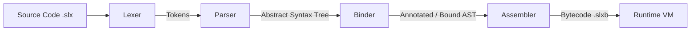

# Solix Compilation Pipeline Architecture

## 1. Overview

The Solix compilation pipeline transforms human-readable Solix source code (`.slx`) into high-performance, compact virtual machine bytecode (`.slxb`), which is then executed by the Solix Runtime Virtual Machine.

The pipeline operates across four discrete stages with strict diagnostic halting boundaries:

If any stage reports one or more compilation errors to the `Diagnostic` context, subsequent stages are halted immediately to prevent generating corrupted bytecode.

---

## 2. Stage Breakdown

### 2.1. Lexical Analysis (`Lexer`)
- **Input**: UTF-8 source string buffer (`CompilationContext::sources`).
- **Output**: Linear stream of `Token` instances (`std::vector<Token>`).
- **Responsibilities**:
  - Strips single-line (`//`) and block (`/* ... */`) comments.
  - Recognizes keywords, operators, identifiers, punctuation, and literals.
  - Discriminated scalar numeric literals (decimal, hex `0x`, binary `0b`, suffixes `L`, `f`).
  - Distinguishes scalar `char` literals (`'c'`) from double-quoted string literals (`"string"`).
  - Tracks 1-based line and column positions for diagnostic reporting.

### 2.2. Syntactic Analysis (`Parser`)
- **Input**: Token stream.
- **Output**: Abstract Syntax Tree (`Node*` hierarchy, rooted at `ProgramNode`).
- **Responsibilities**:
  - Uses recursive descent parsing with operator-precedence climbing for expressions.
  - Constructs strongly typed AST statement and expression nodes defined in `statements.hpp`.
  - Parses class, interface, enum, field, method, and operator declarations.
  - Handles control flow statements (`if`, `for`, `while`, `do-while`, `switch`, `try-catch-finally`).
  - Reports syntactic syntax errors and aborts before semantic binding if malformed.

### 2.3. Semantic Analysis & Type Binding (`Binder`)
- **Input**: Raw AST.
- **Output**: Fully bound and validated AST with symbol tables, resolved types, and ARC insertions.
- **Responsibilities**:
  - Executed across four distinct passes:
    - **Pass 1a**: Registers packages, top-level classes, interfaces, enums, aliases, and imports.
    - **Pass 1b**: Registers member fields, methods, constructors, and assigns VTable IDs.
    - **Pass 2**: Resolves types, checks expression validity, constructs local variable stack layouts, and inserts ARC reference counting hooks (`INC_REF` / `DEC_REF`).
    - **Pass 3**: Monomorphizes template blueprints (`List<int32>`, `Pair<String, int32>`) into concrete class AST declarations.

### 2.4. Bytecode Assembly (`Assembler`)
- **Input**: Semantically validated AST.
- **Output**: Serialized bytecode buffer (`std::vector<uint8_t>`).
- **Responsibilities**:
  - Traverses the AST and emits flat linear opcode instructions matching the Solix VM ISA.
  - Resolves jump offsets and branch targets for loops, conditionals, and exception handling blocks.
  - Emits VTable definitions (`DEFINE_VTABLE`) and native bridge bindings (`DEFINE_NATIVE`).
  - Emits local variable load/store instructions (`GET_LOCAL`, `SET_LOCAL`) and property accesses.
  - Serializes constants into the binary payload.

### 2.5. Virtual Machine Execution (`Runtime`)
- **Input**: Bytecode stream.
- **Output**: Program execution, console output, and exit status code.
- **Responsibilities**:
  - Direct threaded/switch-based instruction dispatcher.
  - Unified stack frame architecture with 65,536 frame call stack.
  - Heap allocator with segregated word tracking and immediate free block recycling.
  - Deterministic ARC cleanup and weak reference zeroing.
  - Exception unwinding through trampoline jump tables.
