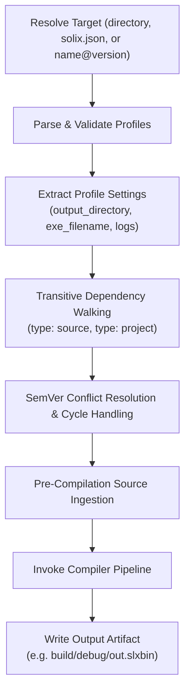

# `solix build` — Project Manifest Build

The `build` subcommand reads a project's manifest file (`solix.json`), resolves declared dependencies, applies profile configurations (`debug`, `release`, `test`), and compiles the project into final artifacts.

---

## Synopsis

```bash
solix build [target] [options]
```

---

## Positional Arguments

| Argument | Type | Default | Description |
|---|---|---|---|
| `target` | Path or Identifier | `solix.json` | Path to project directory, direct path to `solix.json`, or installed package identifier (`name@version`). If omitted, defaults to `solix.json` in current working directory. |

---

## Options & Flags

| Option | Shorthand | Type | Default | Description |
|---|---|---|---|---|
| `--profile` | `-p` | String | `debug` | Build profile name defined in `solix.json` (e.g., `debug`, `release`, `test`). |

> [!NOTE]
> The legacy `-m` / `--manifest` option has been replaced by the optional positional `target` argument to match `solix run` ergonomics.

---

## Dependency Specification in `solix.json`

Project dependencies combine the package name and SemVer version requirement into a single composite string (`name@version`) using either the `"package"` or `"name"` key:

```json
{
  "project": "my_application",
  "version": "1.0.0",
  "dependencies": [
    {
      "type": "source",
      "path": "src/main.slx"
    },
    {
      "type": "project",
      "package": "solixlib@0.1.0"
    }
  ]
}
```

For local dependencies not yet installed in `$SOLIX_HOME`, a relative or absolute `"path"` can still be specified:

```json
{
  "type": "project",
  "path": "../my_local_lib"
}
```

---

## Build Pipeline Lifecycle

When `solix build` is executed:



1. **Target & Manifest Discovery**:
   - If `target` is of the form `name@version` and no local file matches, locates the package in `$SOLIX_HOME` via `PackageManager`.
   - If `target` is a directory, infers `target/solix.json`.
   - If `target` is omitted, defaults to `./solix.json`.
   - Determines project root path from the manifest location.
2. **Profile Validation**:
   - Ensures `profiles` exists and contains the requested profile object.
   - Extracts output paths (`output_directory`, `exe_filename`, `asm_filename`).
   - Relative paths are resolved against the project root.
3. **Pre-Compilation Dependency Resolution**:
   - **Transitive Project Traversal**: Recursively scans `type: "project"` dependencies declared in `dependencies` and active profile's `compilation.additional_dependencies`. Projects are resolved either via explicit `path` or discovered in the local `$SOLIX_HOME` registry via `name@version`.
   - **Circular Dependency Handling**: Cycles (e.g. A depends on B and B depends on A) are recognized and de-duplicated gracefully.
   - **Semantic Version Conflict Resolution**:
     | Version Discrepancy | Behavior | Output |
     |---|---|---|
     | Different Major | Fatal Error; build aborts before compilation | `Error: Incompatible major versions for dependency '...'` |
     | Same Major, Different Minor | Warning; automatically selects highest minor version | `Warning: Project '...' has multiple minor versions (...)` |
     | Same Major and Minor, Different Patch | Clean resolution; silently selects highest patch version | None |
   - **Source Ingestion**: All unique source files across the root and all selected dependent projects are validated and read into in-memory buffers.
4. **Compilation & Artifact Emission**:
   - Executes compiler pipeline with configured entry point and log levels.
   - Emits bytecode binary to the configured profile output directory.

---

## Exit Codes

| Code | Condition |
|---|---|
| `0` | Project built successfully; artifacts written to profile directory. |
| `1` | Missing manifest file, JSON parse error, invalid profile, unresolved dependencies, incompatible major SemVer collision, missing dependency sources, or compiler error. |

---

## Examples

### 1. Build Default Profile in Current Directory
```bash
solix build
# Builds 'debug' profile from ./solix.json into build/debug/out.slxbin
```

### 2. Build Release Profile
```bash
solix build -p release
# Builds 'release' profile into build/release/out.slxbin
```

### 3. Build Project from Directory Path
```bash
solix build ../other_project
# Locates ../other_project/solix.json and builds artifacts relative to that project
```

### 4. Build Project from Direct Manifest Path
```bash
solix build ../other_project/solix.json
# Directly specifies the manifest file to build
```

### 5. Build Installed Package by Identifier
```bash
solix build solixlib@0.1.0
# Locates installed solixlib version 0.1.0 in $SOLIX_HOME and builds its artifacts
```
