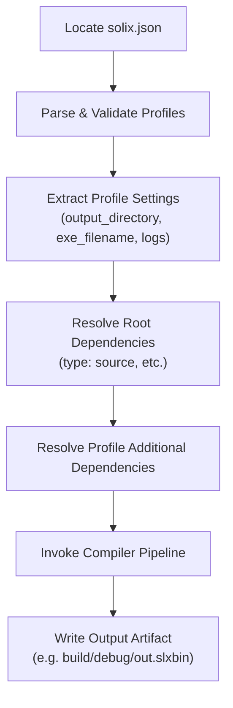

# `solix build` — Project Manifest Build

The `build` subcommand reads a project's manifest file (`solix.json`), resolves declared dependencies, applies profile configurations (`debug`, `release`, `test`), and compiles the project into final artifacts.

---

## Synopsis

```bash
solix build [options]
```

---

## Options & Flags

| Option | Shorthand | Type | Default | Description |
|---|---|---|---|---|
| `--profile` | `-p` | String | `debug` | Build profile name defined in `solix.json` (e.g., `debug`, `release`, `test`). |
| `--manifest` | `-m` | Path | `solix.json` | Path to `solix.json` or path to the project root directory containing it. |

---

## Build Pipeline Lifecycle

When `solix build` is executed:



1. **Manifest Discovery**:
   - Resolves `--manifest` (or current directory `solix.json`).
   - Determines project root path from the manifest location.
2. **Profile Validation**:
   - Ensures `profiles` exists and contains the requested profile object.
   - Extracts output paths (`output_directory`, `exe_filename`, `asm_filename`).
   - Relative paths are resolved against the project root.
3. **Dependency Resolution**:
   - Processes project-level `dependencies` array.
   - Processes profile-level `compilation.additional_dependencies` array.
   - `DependencyManager` resolves local source files into in-memory compilation buffers.
4. **Compilation & Artifact Emission**:
   - Executes compiler pipeline with configured entry point and log levels.
   - Automatically creates destination directories.
   - Writes final binary artifact.

---

## Exit Codes

| Code | Condition |
|---|---|
| `0` | Project built successfully; artifacts written to profile directory. |
| `1` | Missing manifest file, JSON parse error, invalid profile, unresolved dependencies, or compiler error. |

---

## Examples

### 1. Build Default Profile
```bash
solix build
# Builds 'debug' profile into build/debug/out.slxbin
```

### 2. Build Release Profile
```bash
solix build -p release
# Builds 'release' profile into build/release/out.slxbin
```

### 3. Build Project from External Directory
```bash
solix build -m ../other_project
# Locates ../other_project/solix.json and builds artifacts relative to that project
```
