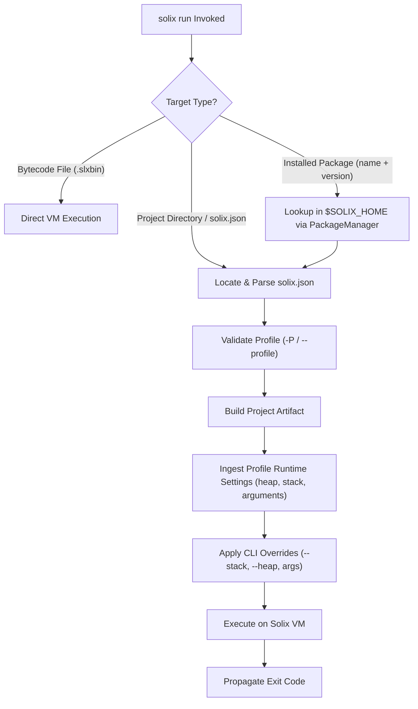

# `solix run` — Bytecode & Project Execution

The `run` subcommand executes compiled Solix bytecode (`.slxb` or `.slxbin`) directly on the Solix Virtual Machine (VM), or automatically builds and runs a Solix project (either from a local directory or installed in `$SOLIX_HOME`) using a user-selected profile.

---

## Synopsis

```bash
# 1. Execute standalone bytecode binary
solix run <file.slxbin> [options] [args...]

# 2. Execute uninstalled project from directory
solix run [<project_dir>] [-P <profile>] [options] [args...]

# 3. Execute installed project from $SOLIX_HOME
solix run -n <package> -v <version> [-P <profile>] [options] [args...]
# or shorthand positional syntax:
solix run <package>@<version> [-P <profile>] [options] [args...]
```

---

## Arguments & Options

### Positional Arguments
| Argument | Type | Required | Description |
|---|---|---|---|
| `[target]` | Path / String | No | Target to run. Can be a compiled bytecode file (`.slxb`/`.slxbin`), a project directory containing `solix.json`, or an installed package specifier (`<name>@<version>`). If omitted and in a directory with `solix.json`, runs the current project. |
| `[args...]` | Strings | No | Optional arguments passed directly to the executing Solix program. |

### Options & Flags
| Option | Shorthand | Type | Default | Description |
|---|---|---|---|---|
| `--profile` | `-P` | String | `debug` | Build profile to build and execute (e.g. `debug`, `release`). |
| `--package` | `-n` | String | `""` | Name of installed package in `$SOLIX_HOME`. |
| `--version` | `-v` | String | `""` | Version of installed package (required when `--package` is used). |
| `--project` | | Path | `""` | Explicit path to project directory or `solix.json`. |
| `--native-lib` | `-L` | Path | `[]` | Path to native shared library (`.dll`, `.so`, `.dylib`). Can be specified multiple times. |
| `--stack` | `-s` | Integer | `1048576` (1 MWord) | Call stack capacity in 64-bit machine words. |
| `--heap` | `-p` | Integer | `16777216` (16 MWords) | Flat object heap capacity in 64-bit machine words. |

---

## Native Shared Library Loading & Auto-Discovery

When running standalone bytecode or a Solix project, the runtime automatically discovers and binds native C/C++ shared libraries (`.dll` on Windows, `.so` on Linux, `.dylib` on macOS):

1. **Zero-Config Auto-Discovery**:
   - For projects: automatically scans and loads any shared library found in the project's `./lib/` directory or in the output directory containing the generated `.slxbin`.
   - For standalone bytecode: automatically scans and loads any shared library located in the same directory as the `.slxbin` or in a co-located `./lib/` subdirectory.
2. **Manifest Configuration**:
   - Ingests `"native_libraries": [...]` declared at the root of `solix.json` or within `profiles.<name>.runtime.native_libraries`.
3. **CLI Overrides (`-L, --native-lib`)**:
   - Additional shared libraries can be explicitly passed at runtime via `-L <path>` or `--native-lib <path>`. All specified libraries are loaded into memory and registered before program execution begins.


---

## Project Execution Lifecycle

When running a project (uninstalled directory or installed package):



1. **Target Identification**:
   - If `--package` and `--version` (or `<name>@<version>`) are provided, resolves the installed project from `$SOLIX_HOME`.
   - If a directory is provided (or current directory has `solix.json`), treats it as an uninstalled project.
   - If an existing file is provided, executes the bytecode binary directly.
2. **Pre-Execution Build**:
   - Reuses the modular build pipeline (`DependencyManager` + Compiler) to build the requested `--profile` before invoking the VM.
3. **Runtime Configuration Ingestion**:
   - Reads `profiles.<profile>.runtime` from `solix.json`. If `stack_size`, `heap_size`, or default `arguments` are configured in the manifest, they are applied unless overridden by CLI flags.
4. **Execution & Exit Code**:
   - Executes the bytecode on the VM and propagates the exit code returned by `main()`.

---

## Exit Codes & Fault Handling

| Exit Code | Condition |
|---|---|
| `0` | Bytecode executed successfully and the entry method returned 0. |
| `1` | Missing file/project, manifest error, invalid profile, compilation failure, unhandled runtime exception, or memory exhaustion. |
| `N` (`N > 0`) | The entry method returned non-zero integer `N`, which is propagated directly to the host shell. |

---

## Examples

### 1. Execute Compiled Bytecode Binary
```bash
solix run build/debug/out.slxbin arg1 arg2
```

### 2. Run Local Project (Default Debug Profile)
```bash
solix run ./my_app
# or inside project folder:
solix run .
```

### 3. Run Local Project with Release Profile
```bash
solix run ./my_app -P release
```

### 4. Run Installed Project by Name and Version
```bash
solix run -n math_utils -v 1.2.0 -P release
# or shorthand syntax:
solix run math_utils@1.2.0 -P release
```

### 5. Run with Custom Memory Limits
```bash
solix run ./my_app -s 2097152 -p 33554432
```

